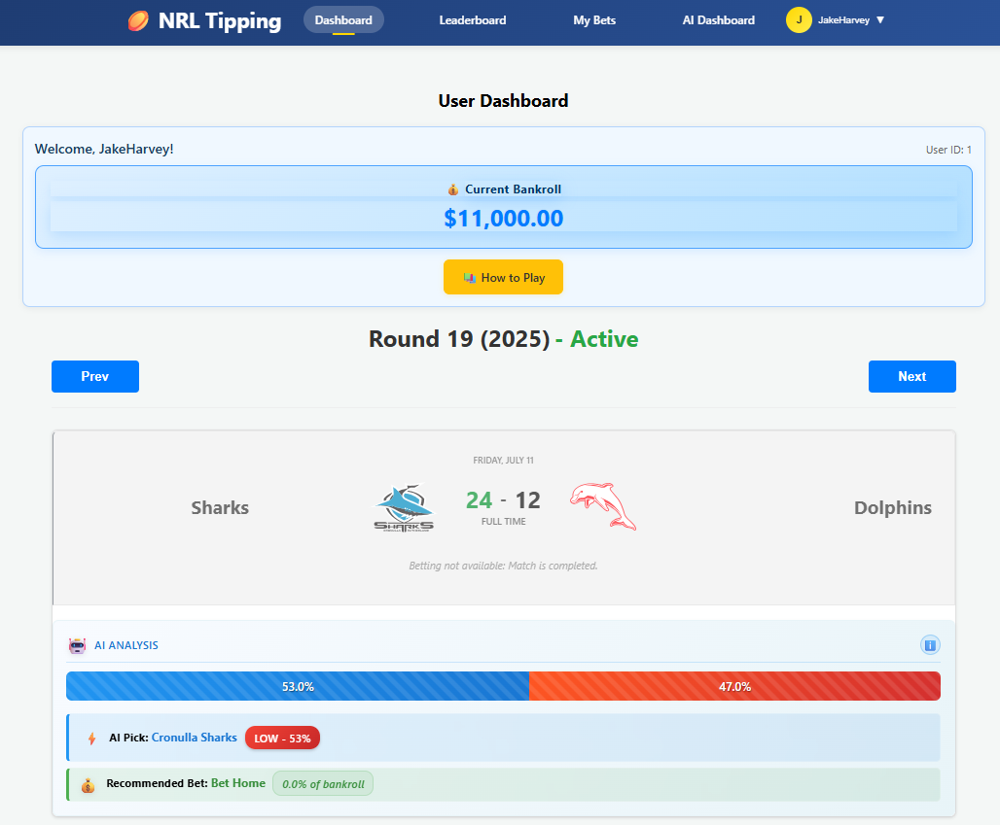
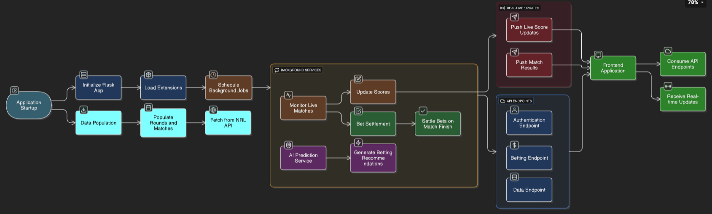
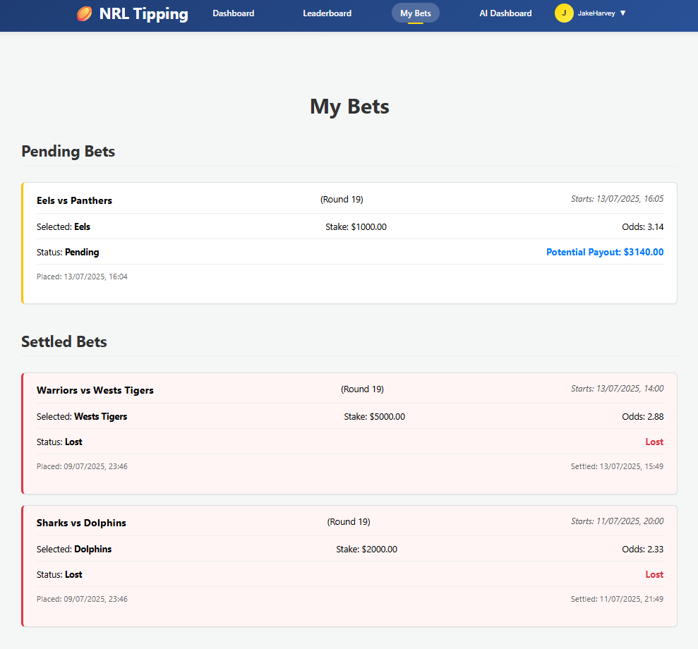

# NRL Tipping Application Backend 
[Launched Website](https://nrltipping.vercel.app/)



## Description

A comprehensive Flask-based backend API for an NRL (National Rugby League) tipping application that combines real-time match data, AI-powered predictions, and social betting features. The application automatically scrapes live match results, settles bets, and provides intelligent betting recommendations using machine learning models.

**Note**: This repository contains the backend API services only. For the complete web application, you'll also need the frontend repository: [nrl-tipping-app-frontend](https://github.com/JakeHarveyy/nrl-tipping-app-frontend). The frontend provides the user interface and interacts with this backend via REST API endpoints.

## Languages and Libraries Used

### Core Technologies
- **Python 3.13.1** - Primary programming language
- **Flask 3.1.0** - Web framework for API development
- **SQLAlchemy** - ORM for database operations
- **MySQL** - Primary database for production
- **SQLite** - Development database

### Key Libraries
- **Flask-RESTful** - RESTful API development
- **Flask-JWT-Extended** - JWT authentication
- **Flask-CORS** - Cross-origin resource sharing
- **Flask-APScheduler** - Background job scheduling
- **Authlib** - OAuth integration (Google Sign-In)
- **Pandas & NumPy** - Data manipulation and analysis
- **Scikit-learn** - Machine learning models
- **Beautiful Soup** - Web scraping for match results
- **Alembic** - Database migrations


## File Structure

```
nrl-tipping-app-backend/
├── app/
│   ├── __init__.py                 # Flask app factory and configuration
│   ├── config.py                   # Environment-specific configurations
│   ├── models.py                   # SQLAlchemy database models
│   ├── sse_events.py              # Server-sent events for real-time updates
│   ├── ai_models/
│   │   ├── data/                   # Training data and feature files
│   │   ├── prediction/             # AI prediction models and services
│   │   ├── nrl_baseline_logistic_model.pkl
│   │   └── nrl_feature_scaler.pkl
│   ├── api/
│   │   ├── routes.py               # REST API endpoints
│   │   └── settlement.py           # Bet settlement logic
│   ├── services/
│   │   ├── ai_prediction_service.py    # AI prediction orchestration
│   │   ├── betting_service.py          # Betting business logic
│   │   └── results_scraper_service.py  # Match data scraping
│   └── utils/                      # Utility functions
├── migrations/                     # Database migration files
├── run.py                         # Application entry point and CLI commands
├── requirements.txt               # Python dependencies
├── docker-compose.yml            # Docker configuration
├── Procfile                      # Heroku deployment configuration
└── README.md                     # Project documentation
```

## High-Level Execution Flow



## Installation Instructions

### Prerequisites
- Python 3.13.1 or higher
- MySQL server (for production) or SQLite (for development)
- Git

### Complete Application Setup

For the full application experience, you'll need both repositories:

1. **Backend (this repository)**: Follow the instructions below
2. **Frontend**: Clone and set up [nrl-tipping-app-frontend](https://github.com/JakeHarveyy/nrl-tipping-app-frontend)

### Local Development Setup

1. **Clone the repository**
   ```bash
   git clone https://github.com/JakeHarveyy/nrl-tipping-app-backend.git
   cd nrl-tipping-app-backend
   ```

2. **Create and activate virtual environment**
   ```bash
   python -m venv venv
   
   # On Windows
   venv\Scripts\activate
   
   # On macOS/Linux
   source venv/bin/activate
   ```

3. **Install dependencies**
   ```bash
   pip install -r requirements.txt
   ```

4. **Environment Configuration**
   Create a `.env` file in the root directory:
   ```env
   FLASK_ENV=development
   SECRET_KEY=your-secret-key-here
   DATABASE_URL=sqlite:///nrl_tipping.db
   JWT_SECRET_KEY=your-jwt-secret-here
   
   # Google OAuth (optional)
   GOOGLE_OAUTH_CLIENT_ID=your-google-client-id
   GOOGLE_OAUTH_CLIENT_SECRET=your-google-client-secret
   
   # Frontend URL (adjust based on your frontend setup)
   FRONTEND_URL=http://localhost:3000
   ```

5. **Initialize the database**
   ```bash
   flask db init
   flask db migrate -m "Initial migration"
   flask db upgrade
   ```

6. **Populate initial data**
   ```bash
   # Create AI bot user
   flask create-bot LogisticsRegressionBot
   
   # Populate NRL schedule (adjust year as needed)
   flask populate-schedule --year=2024
   ```

7. **Run the application**
   ```bash
   python run.py
   ```

The API will be available at `http://localhost:5000`

**Next Step**: Set up the [frontend application](https://github.com/JakeHarveyy/nrl-tipping-app-frontend) to interact with this backend.

## How to Use the Project

### API Endpoints

This backend provides RESTful API endpoints that are consumed by the frontend application:

#### Authentication
- `POST /api/register` - User registration
- `POST /api/login` - User login
- `POST /api/google/login` - Google OAuth login
- `POST /api/refresh` - Refresh JWT token

#### Matches and Rounds
- `GET /api/rounds` - Get all rounds
- `GET /api/matches` - Get matches with filtering options
- `GET /api/matches/<id>` - Get specific match details

#### Betting
- `POST /api/bet` - Place a bet
- `GET /api/user/bets` - Get user's betting history
- `GET /api/user/bankroll-history` - Get bankroll transaction history

#### AI Predictions
- `GET /api/ai/predictions/<round_number>/<year>` - Get AI predictions for a round
- `GET /api/ai/bot/bets` - Get AI bot's betting history

#### Real-time Updates
- `GET /api/sse/events` - Server-sent events stream for live updates

### CLI Commands

The backend includes several CLI commands for data management:

```bash
# Populate schedule from NRL.com
flask populate-schedule --start_round=1 --end_round=27 --year=2024

# Create AI bot user
flask create-bot LogisticsRegressionBot

# Run AI predictions manually
flask run-ai-predictions --round_number=1 --year=2024

# Run AI predictions for current round
flask run-ai-predictions --year=2024
```

### Example Usage

```python
import requests

# Login
response = requests.post('http://localhost:5000/api/login', json={
    'username': 'testuser',
    'password': 'password123'
})
token = response.json()['access_token']

# Place a bet
headers = {'Authorization': f'Bearer {token}'}
bet_response = requests.post('http://localhost:5000/api/bet', 
    headers=headers,
    json={
        'match_id': 1,
        'bet_type': 'home',
        'amount': '10.00'
    }
)
```


## Contribution Guidelines

We welcome contributions to improve the NRL Tipping Application! Please follow these steps:

1. **Fork the Project**
   - Click the "Fork" button on the repository page
   - Clone your forked repository locally

2. **Create a Feature Branch**
   ```bash
   git checkout -b feature/amazing-new-feature
   ```

3. **Make Your Changes**
   - Follow Python PEP 8 style guidelines
   - Add tests for new functionality
   - Update documentation as needed

4. **Commit Your Changes**
   ```bash
   git add .
   git commit -m "Add amazing new feature"
   ```

5. **Push to Your Branch**
   ```bash
   git push origin feature/amazing-new-feature
   ```

6. **Open a Pull Request**
   - Navigate to the original repository
   - Click "New Pull Request"
   - Provide a clear description of your changes

## Contact Details

- **Project Maintainer**: Jake Harvey
- **Email**: [harvey.jake.roy@gmail.com]
- **GitHub**: [@JakeHarveyy](https://github.com/JakeHarveyy)
- **LinkedIn**: [Your LinkedIn Profile](https://linkedin.com/in/jake-harvey-b72016341/)

For bug reports and feature requests, please use the [GitHub Issues](https://github.com/JakeHarvey/nrl-tipping-app-backend/issues) page.

## Related Repositories

- **Frontend Application**: [nrl-tipping-app-frontend](https://github.com/JakeHarveyy/nrl-tipping-app-frontend) - React-based user interface
- **AI Model Development**: [LogisticsRegression-NRLPredictor](https://github.com/JakeHarveyy/LogisticsRegression-NRLPredictor) - Complete machine learning workflow including feature engineering, model training, and validation for NRL match predictions


## Acknowledgements

- **NRL.com** - For providing match data and schedules through their API
- **Flask Community** - For the excellent web framework and extensions
- **Scikit-learn** - For machine learning capabilities
- **Google OAuth** - For secure authentication services
- **Contributors** - Thank you to all contributors who help improve this project

---

## License

This project is licensed under the MIT License - see the `LICENSE` file for details.

---

*Built with ❤️ for Machine learning enthusiast who enjoy the NRL*

*Up the Tigers*
